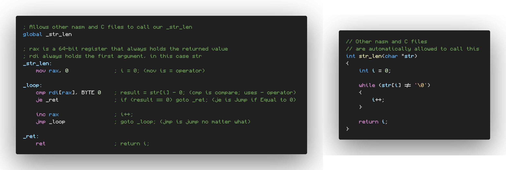

# Summary

## Registers

Arguments:
1. rdi
2. rsi
3. rdx
4. rcx
5. r8
6. r9

`rax` is the return value.

# Used documentation

* [Mac assembly basics](http://www.idryman.org/blog/2014/12/02/writing-64-bit-assembly-on-mac-os-x/)
* [x86_64 cheat sheet](https://www.cs.uaf.edu/2017/fall/cs301/reference/x86_64.html)
* [How to make syscalls](https://stackoverflow.com/q/47834513/13279557)
* [How to detect syscall errors](https://stackoverflow.com/a/47836054/13279557)
* [Copying individual bytes](https://stackoverflow.com/a/65527553/13279557)

# Translate C to nasm

1. `gcc -fno-asynchronous-unwind-tables -O2 -s -c -o foo.o foo.c`
2. `objconv -fnasm foo.o`
3. `nasm -f elf64 foo.asm`, which overwrites the previous `.o` file
4. `gcc foo.o`

# Registers that the called function is required to preserve

* rbx
* rsp
* rbp
* r12
* r13
* r14
* r15

[Source 1](https://cs.lmu.edu/~ray/notes/nasmtutorial/)
[Source 2](https://wiki.osdev.org/System_V_ABI#x86-64)
